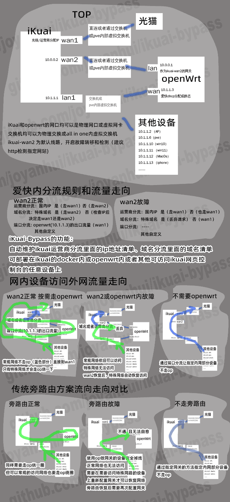

# iKuai Bypass

通过自定义运营商分流或者端口分流的方式实现非旁路由方式的自动分流，并定时更新规则。实现国内ip或者指定的ip或者指定的域名列表走直连或者经过openwrt等另外处理。爱快有简单易用的分流功能可以实现诸多功能，但是因为大家喜闻乐见的分流规则数据可能几万条，在ikuai上维护更新比较麻烦，这个工具就是为了自动从订阅地址更新爱快的分流规则的域名分流和运营商分流。

> 如有bug反馈和建议都可以提[issues](https://github.com/joyanhui/ikuai-bypass/issues)，我会尽快处理。给个star我会很开心。

> 关于dns部分，建议用mosdns自建，这里有一个本人维护的支持自动更新相关规则文件的mosdns的docker.[[joyanhui/mosdns]](https://github.com/joyanhui/mosdns).可以简单自动更新dns分流解析规则，广告屏蔽，以及ipv4优先等功能

## 版本选择

- v2.1.2-alpha1 虽然是alpha版，但是功能已经稳定 存在少量不影响使用的bug
- v3.0.0 版本 增加了ipv6分组 由 [[dscao]](https://github.com/dscao) 提供

### ip分组和端口分流方式 说明：

ikuai 可以通过分流规则 让国内ip直连（或其他ip范围），非国内ip指定下一跳网关通常是openwrt。再把出口流量给上游运营商。实现方式参考[[#7]](https://github.com/joyanhui/ikuai-bypass/issues/7) 或者 [[恩山y2kji]](https://www.right.com.cn/forum/thread-8288009-1-1.html) 或B站网友的教程

### 自定义运营商分流方式 说明：

ikuai 可以通过分流规则 把openwrt或者其他路由作为爱快的上级虚拟运营商，同时作为ikuai的下级路由，再把openwrt的出口流量绑回到爱快实际的运营商，实现无感分流：国内网站访问速度更好、不用单独配置网关、openwrt炸了不影响正常上网、openwrt恢复后网络自愈。[查看具体实现方式](https://dev.leiyanhui.com/route/ikuai-bypass-joyanhui/) 或者查看 [恩山eezz](https://www.right.com.cn/forum/thread-8252571-1-1.html) 或者下文 [分流模式的简单说明](https://github.com/joyanhui/ikuai-bypass?tab=readme-ov-file#%E5%88%86%E6%B5%81%E6%A8%A1%E5%BC%8F%E7%AE%80%E5%8D%95%E8%AF%B4%E6%98%8E)。这种方式比传统用openwrt的作为旁路由的指定网关的方案，或者only openwrt的方案更加稳定，速度更好。 `缺点是 网络top看起来有一些复杂，非开箱即用`

#### 运营商和域名分流模式简单说明

通常是爱快+openwrt的双路由方式，ikuai可以是物理机也可以是虚拟机。openwrt同样可以是物理机也可以是虚拟机，也可以是lxc/docker也可以部署到爱快内。ikuai需要分配3个网口（分别绑定到wan1 wan2 lan1），openwrt需要2个（wan和lan）。可以是物理网卡也可以是虚拟网卡。

<details>
<summary>点击这里展开查看详细图文说明</summary>

</details>

## 主要修改点

- 两个协程并发处理运营商/IP分流和域名分流,更新速度更快。
- 更新成功后再删除旧规则,原版会先删除,如果更新失败就全部丢了，这也是自己下手修改的主要原因。 v2.0.1后版本增加参数调整更新后删除还是更新之前删除。 [[#15]](https://github.com/joyanhui/ikuai-bypass/issues/15)
- 支持清理模式，单次更新模式，先更新一次再等计划任务触发模式，等待计划任务触发模式。
- 支持域名分流规则直接导出为爱快可导入的txt格式 [[#5]](https://github.com/joyanhui/ikuai-bypass/issues/5)
- 支持无docker运行，当然也支持docker运行。
- 编译了 linux macos windows freebsd 系统下arm5-7 arm64 mipsle mips64le ppc64le amd64 386 架构二进制，当然也支持openwrt、老毛子和有shell权限其他系统。

## 参数说明

- `-c` : 配置文件路径 默认为当前目录下`config.yml` 可用相对路径或者绝对路径
- `-m` : 是否启用ip分组和下一跳网关模式（端口分流）v2.0以后版本有效
  - `ispdomain` : 使用isp和域名分流功能(默认，为了兼容v1.x版本)
  - `ipgroup` : 使用ip分组和下一跳网关模式（端口分流)
  - `ipv6group` : 使用ipv6分组(配合acl控制使用优先允许国内ipv6，次要不允许所有ipv6)
  - `ii` : 同时使用 ispdomain 和 ipgroup 两种模式
  - `ip` : 同时使用 ipgroup 和ipv6group 两种模式
- `-r` : 运行模式 默认为`cron`
  - `cron` : 先运行一次 而后等待计划任务触发
  - `nocron` 或 `once`或 `1`: 忽略配置文件的cron定时配置配置 运行一次然后就直接退出结束，适合调试使用或者使用系统自带的计划任务或serverless/函数计算等方式触发。
  - `cronAft` : 先不运行等计划任务触发
  - `clean` : 清理模式 默认可选附加参数为 `-tag cleanAll`
  - `exportDomainSteamToTxt` : 导出域名分流规则到txt文件模式 方便手动从爱快导入 默认可选附加参数为 `-exportPath /tmp` 暂时只支持域名分流功能导出，
- `-tag` : 备注信息 `clean`清理模式下的附加参数
  - 默认为cleanAll(即清理所有备注中包含`IKUAI_BYPASS`字符的规则)
  - 单独指定备注的关键词 可以不添写`IKUAI_BYPASS_`前缀 例如`-r clean -tag ipcn` 或 `-r clean -tag IKUAI_BYPASS_ipcn`
- `-exportPath` : 导出域名分流规则的路径
- `-login` : ikuai登陆地址和账户密码，优先级比配置文件的优先级更高。格式: `http://10.1.1.1,admin,password` 为空则使用配置文件内登陆信息
- `-delOldRule` : 删除旧规则顺序，默认为 `after`
  - `after` : 先更新规则成功后再删除旧规则
  - `before` : 先删除旧规则再更新新规则，如果更新失败会丢失规则
- `- isIpGroupNameAddRandomSuff` ip分组名称是否增加随机数后缀(仅ip分组模式有效) 1为添加 0不添加

## 更新日志

- 2025-04-23 部分代码规范性处理以及nilness的逻辑修复
- 2025-04-23 增加开关isIpGroupNameAddRandomSuff [[#76]]
- 2025-04-23 修复域名分流规则末行空行的bug [[#24]]
- 2025-03-25 增加端口分流时能够选择更多参数：负载模式、线路绑定，修复完善delOldRule参数，对于ip分组、ipv6分组及端口分流都默认为先增加后删除，防止增加失败导致原来的规则丢失。
- 2025-03-23 增加ipv6分组
- 2024-10-04 提供完整的最新的config.yml 文件，供参考
- 2024-10-04 修复端口分流规则自动添加未能关联ip分组的bug，本次修改更新了一下config.yml的默认内容，请注意更新您的配置文件。[[#30]](https://github.com/joyanhui/ikuai-bypass/issues/30)
- 2024-10-04 修复清理模式的删除规则问题 [[#27#issuecomment-2388114699]](https://github.com/joyanhui/ikuai-bypass/issues/27#issuecomment-2388114699)
- 2024-10-04 ip分组第一行的备注问题 [[#22]](https://github.com/joyanhui/ikuai-bypass/issues/22)
- 2024-10-04 修复 卡`ip分组== 正在查询  备注为: IKUAI_BYPASS_ 的ip分组规则` 的bug [[#24]](https://github.com/joyanhui/ikuai-bypass/issues/24) [[#27]](https://github.com/joyanhui/ikuai-bypass/issues/27)
- 2024-10-04 修复运营商分流的ip列表会添加一个空行的bug [[#24]](https://github.com/joyanhui/ikuai-bypass/issues/24)
- 2024-06-29 修复清理模式无法清理ip分组和端口分流规则的问题 v2.0.1以后版本有效
- 2024-06-29 增加运营商和域名分流规则旧规则删除模式参数 `-delOldRule` [[#15]](https://github.com/joyanhui/ikuai-bypass/issues/15) v2.0.1以后版本有效
- 2024-06-29 修改-m参数默认值错误导致的不配置-m参数无法执行的问题 构建 v2.0.0-beta2 版本 这是一个未经过详细测试的版本，请谨慎使用。
- 2024-05-26 修复OLOrz996分支里端口分流规则模式无法删除的bug
- 2024-05-26 合并ztc1997的ip分组和下一跳网关功能[[#7]](https://github.com/joyanhui/ikuai-bypass/issues/7) 增加了 `-m`参数
- 2024-05-26 命令行参数增加-login参数，可以覆盖配置文件内的爱快地址和用户名密码
- 2024-03-23 增加域名分流规则导出为爱快兼容的可导入的txt文件 [[5#2016320900]](https://github.com/joyanhui/ikuai-bypass/issues/5#issuecomment-2016320900)
- 2024-03-23 尝试修复列表太多导致爱快处理超时的问题 [[#5]](https://github.com/joyanhui/ikuai-bypass/issues/5)
- 2024-03-07 openwrt服务安装脚本增加无代理环境安装
- 2024-02-25 增加去广告功能演示规则 [[参考]](https://github.com/joyanhui/ikuai-bypass/blob/main/config_example.yml)
- 2024-02-7 添加一个openwrt下开机自动运行 [[参考脚本]](https://github.com/joyanhui/ikuai-bypass/blob/main/script-example/AddOpenwrtService.sh)
- 2024-02-1 优化清理模式的提示信息，增加`once`或 `1`模式等同于nocron模式
- 2024-02-1 某一分组规则更新失败导致相关的旧规则被删除的bug [[#3]](https://github.com/joyanhui/ikuai-bypass/issues/3)
- 2024-02-1 清理模式增加附加参数`-tag` 可以清理全部备注名包含`IKUAI_BYPASS`的分流规则，或者指定备注名全程或者后缀名的分流规则
- 旧的更新记录没啥价值也未单独记，小工具代码简单，请参考commit记录

## todo list

- 在性能受限制的爱快上域名分流过多导致爱快接口超时，进一步导致ikuai-bypass出错的bug [[#5]](https://github.com/joyanhui/ikuai-bypass/issues/5)
- [[done]]ip分组和端口分流规则 修改为成功后再删除旧规则
- [[done]]优化ip分组和下一跳网关功能 可能存在的bug问题
- [[done]](https://github.com/joyanhui/ikuai-bypass/issues/33)时区问题需要检查

## 简要使用说明

从 Releases [[下载]](https://github.com/joyanhui/ikuai-bypass/releases) 解压后得到一个可执行文件`ikuai-bypass`和一个通用配置文件 `config.yml` [[参考]](https://github.com/joyanhui/ikuai-bypass/blob/main/config_example.yml) 编辑一下`config.yml`里面ikuai的地址用户名和密码，然后在可以访问到ikuai的设备上执行命令格式如下: ` ./ikuai-bypass -c /配置文件路径/config.yml -r 运行模式`即可。example: `./ikuai-bypass` 等同 `./ikuai-bypass -c config.yml -r cron`: 将根据配置文件的内容更新分流规则更新成功后删除旧的分流规则 并在配置文件的cron的时间按照计划任务 重新更新。 `./ikuai-bypas -r clean` 等同 `./ikuai-bypass -c config.yml -r clean -tag  cleanAll` : 删除所有备注包含 `IKUAI_BYPASS`的规则 `./ikuai-bypas -r clean  -tag IKUAI_BYPASS_ipcn` 等同 `./ikuai-bypas -r clean  -tag ipcn`: 删除备注为 `IKUAI_BYPASS_ipcn` 的分流规则

## 不同平台下

### linux(推荐openwrt内直接运行)

下载 linux-xxx.zip,unzip 后在shell运行。 建议把ikuai-bypass作为服务安装到openwrt [[参考安装脚本]](https://github.com/joyanhui/ikuai-bypass/blob/main/script-example/AddOpenwrtService.sh)

### docker

下载linux版本，参考命令如下

```sh
mkdir ~/ikuai-bypass/ && cd ~/ikuai-bypass
# 下载amd64版本，如arm版本自行修改
wget -c https://github.com/joyanhui/ikuai-bypass/releases/download/v0.2.2/ikuai-bypass-linux-amd64.zip
unzip ikuai-bypass-linux-amd64.zip
# 编辑默认的 config.yml  略
# 创建容器 docker/podman
docker run -itd  --name ikuai-bypass  --privileged=true --restart=always   \
    -v  ~/ikuai-bypass/:/opt/ikuai-bypass/   \
    alpine:3.18.4  /opt/ikuai-bypass/ikuai-bypass -c  /opt/ikuai-bypass/config.yml -r cron
```

### ikuai docker下

`ikuai`无法直接执行`shell`命令，基于`golang`的`ikuai-bypass`没有外部依赖只是一个可执行文件。

如果您要在`ikuai`的`docker`内运行，请自行下载`linux`版本的Release，解压后，上传可执行文件和修改后的配置文件到`ikuai`。

例如创建对应的docker目录并上传：

```
/data0/Docker/ikuai-bypass/ikuai-bypass
/data0/Docker/ikuai-bypass/config.yml
```

而后在`ikuai`的`docker`中下载通用`linux`镜像，推荐`alpine:lastest`（实测Ubuntu，busybox等镜像不安装证书扩展会报github加速代理的证书问题）。

创建`docker`目录挂载`/data0/Docker/ikuai-bypass/`到容器内`/opt/ikuai-bypass/`

启动命令设置为:

```sh
/bin/sh -c "chmod +x /opt/ikuai-bypass/ikuai-bypass  && /opt/ikuai-bypass/ikuai-bypass -r cron -c  /opt/ikuai-bypass/config.yml"
```

再启动即可。

### 群晖或compose:

请自行下载`linux`版本的Release，解压后，上传可执行文件和修改后的配置文件到`/volume1/docker/ikuai-bypass/data/`。群晖项目或compose同时运行多个配置文件示例：

```version: '3.8'

services:
  ikuai-bypass:
    image: alpine:3.18.4
    container_name: ikuai-bypass
    privileged: true
    volumes:
      - /volume1/docker/ikuai-bypass/data/:/opt/ikuai-bypass
    command: sh -c "/opt/ikuai-bypass/ikuai-bypass -c /opt/ikuai-bypass/config.yml -r cron -m ip & sleep 30 ; /opt/ikuai-bypass/ikuai-bypass -c /opt/ikuai-bypass/config2.yml -r cron -m ip  ; wait"
    tty: true
```

### windows

请在 releases 里面点击 `show all xx assets` 可以看到windows的包 下载解压cmd下cd到解压后的目录运行里面的exe程序。或许因ikuai-bypass需要获取在线数据,并使用了upx压缩,也没有另外加壳,部分杀软可能会报毒或者安全风险，[[#6]](https://github.com/joyanhui/ikuai-bypass/issues/6) 请自行决定是否信任,或者安装go环境后git clone后自行编译。我没有WIN环境,也不打算解决此类问题。

### macos下

下载 darwin-arm64.zip 或者darwin-amd64.zip,unzip 后在shell运行。其他参考上文linux

## v0.1.15 升级0.2版

v0.2.x 以后规则的备注不再只有字符`IKUAI_BYPASS`,会根据tag添加指定的后缀,所以升级到0.2.x后最好清理掉旧的分流规则重新添加。另外新版配置文件中每条规则都多了一个 `tag: 备注后缀` 用于区分不同的规则 [[参考]](https://github.com/joyanhui/ikuai-bypass/blob/main/config_example.yml)

```sh
./ikuai-bypass -c /路径/config.yml -r clean -tag cleanAll # 清理所有备注名包含`IKUAI_BYPASS`的分流规则
./ikuai-bypass -c /路径/config.yml -r cron #先运行一次 而后等待计划任务触发
```

## 我自用过的环境

单网口/双网口

- pve宿主 kvm 运行ikuai,然后opewrt在kvm/lxc下，ikuai-bypass 部署在openwrt。
- windows宿主 + vmware 桥接网卡爱快 ,openwrt在vmware的ikuai内的vm内，ikuai-bypass 部署在openwrt。
- windows宿主 + hyperv 桥接网卡爱快,openwrt在vbox的ikuai内的vm内，ikuai-bypass 使用instsrv+srvany部署到windows。
- nixos宿主 + virtualbox 桥接网卡爱快,openwrt在vbox的ikuai内的vm内，ikuai-bypass 部署在openwrt。

## 其他相关说明

[https://dev.leiyanhui.com/route/ikuai-bypass-joyanhui/](https://dev.leiyanhui.com/route/ikuai-bypass-joyanhui/)

## 致谢

- [恩山ztc1997](https://github.com/ztc1997/ikuai-bypass/): 本项目fork自ztc1997, 感谢原作者实现的核心功能，我只是简单缝补了几个小地方。
- [JetBrains](https://jb.gg/OpenSourceSupport): 为本项目提供免费的开源许可证
- [neovim](https://neovim.io/),[NvChad](https://github.com/NvChad/NvChad),[elulcao](https://github.com/elulcao/NvChad-custom)
