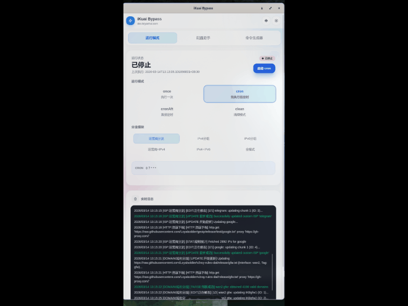
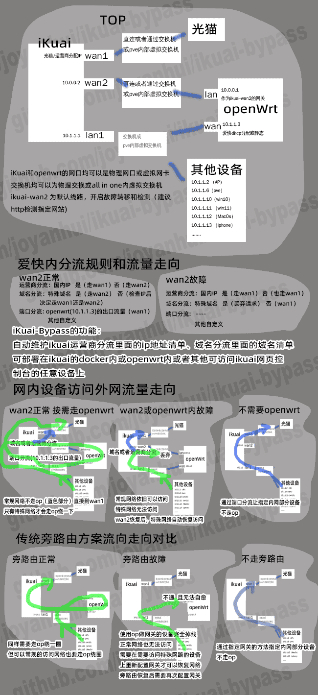

# iKuai Bypass

  

**iKuai Bypass** 是一款爱快路由器专用的分流规则自动同步工具。它可以自动从网上下载 IP/域名列表并同步到你的路由器，让你的流量自动走正确的线路。比如：主流网站和国内ip流量通过光猫直连、特殊流量走旁路由，无需手动配置每一条规则。
并可以灵活控制内网每台设备的流量并可适配爱快ACL规则。

提供两种安装方式：
- GUI：图形化桌面和手机 App，支持 Windows / macOS / Linux 桌面端和 Android / iOS 移动端
- CLI：命令行，可以完全不使用图形界面完成所有功能，也有一个可选的基于浏览器的web界面。适合 Nas AIO PVE Docker 等部署使用。
> **提示**：旧版本go代码已归档到分支[v4.4.13](https://github.com/joyanhui/ikuai-bypass/releases/tag/v4.4.13),新版本使用rust+tauri构建,因分支替换之前fork本仓库的可能需要重新操作。 如果你在使用 爱快3.7以及以前的版本，请使用[v4.2.0](https://github.com/joyanhui/ikuai-bypass/releases/tag/v4.2.0)。你可能需要阅读[update‐to‐v4.4.10x](https://github.com/joyanhui/ikuai-bypass/wiki/v4.4.13%E2%80%90update%E2%80%90to%E2%80%90v4.4.10x)
> 如果这个项目对你有帮助，请点个 Star！star数是作者唯一的维护动力。

> 关于dns分流解析，建议用单 ADGuard home自建，这里有一个本人利用github action自动维护相关规则文件的adguardhome规则.[[joyanhui/adguardhome-rules]](https://github.com/joyanhui/adguardhome-rules)（规则文件在release_file分支48小时更新一次）。可以简单自动更新dns分流解析规则，广告屏蔽，以及ipv4优先等功能

---


## 爱快两种分流模式解析

本项目支持两种主流的分流实现方案，您可以根据自己的网络拓扑选择最合适的模式。

### 1. 自定义运营商分流模式 (推荐)

**适用场景：** 追求极致稳定性、网络自愈、终端无感分流。（需要多网卡或能添加虚拟网卡）

**实现逻辑：**
这种模式下，iKuai 将 旁路由（通常是openwrt）视为一个"虚拟的上级运营商"。
1. 链路设计：旁路由 作为 iKuai 的下级设备接收流量，处理后再将出口流量"绕回"给 iKuai 的 WAN 口。
2. 规则同步：本工具将目标 IP 列表导入 iKuai 的"自定义运营商"。iKuai 会认为这些 IP 属于该"虚拟运营商"，从而将流量转发给 旁路由。

**核心优势：**
- 极高可靠性：旁路由 宕机只会导致被分流的流量中断，普通流量依然通过主线直连，不会全家断网。
- 配置无感：终端设备无需更改网关配置，完全由 iKuai 在内核层级完成调度。
- 性能优异：直连速度最快，旁路仅处理特定流量。

**参考文档**：[查看具体实现方式](https://dev.leiyanhui.com/route/ikuai-bypass-joyanhui/) 或 [恩山eezz的教程](https://www.right.com.cn/forum/thread-8252571-1-1.html)。

<details>
<summary>点击这里展开查看详细图文说明</summary>

</details>

### 2. IP 分组与端口分流模式 (传统模式)

**适用场景：** 简单的旁路由方案，逻辑直接。

**实现逻辑：**
1. IP 分组：本工具将订阅的 IP 列表同步到 iKuai 的"IP 分组"中。
2. 策略路由：利用 iKuai 的"端口分流"功能，匹配目标地址为该分组的流量，将其"下一跳网关"指向 旁路由 的 IP。

**特点**：配置简单直接，旁路由 宕机时匹配到该分组的规则将无法上网。

**参考文档**：[实现方式参考](https://github.com/joyanhui/ikuai-bypass/issues/7) 或 [恩山y2kji的教程](https://www.right.com.cn/forum/thread-8288009-1-1.html)。

---

## 主要功能特性

- 安全可靠：更新规则时不会中断现有分流功能。如果下载失败，会保留旧规则不清理，确保你的网络始终正常。
- 多种分流模式：支持自定义运营商、IP分组、域名分流、端口分流等，满足不同网络需求。
- 全自动运行：设置好后定时自动更新规则。
- 一键清理：不需要了可以一键删除所有规则，干净利落。
- 全平台支持：Windows、macOS、Linux、FreeBSD、Android(termux)、Android、iOS 全平台覆盖，还有 Docker 和 PVE LXC/CT版本。甚至支持mips、arm5等上古硬件。
- 界面友好：提供网页管理界面和桌面/手机 App，多端界面统一。

---

## 快速上手

### 1. 下载

从 [Releases](https://github.com/joyanhui/ikuai-bypass/releases) 下载适合你系统的版本。

**选哪个版本？**

| 你的系统 | 推荐下载 |
| :--- | :--- |
| Windows 桌面 | `ikuai-bypass-gui-windows-x86_64.zip` 解压即可 |
| macOS 桌面 | `ikuai-bypass-gui-macos-aarch64.dmg`（M芯片）或 `x86_64.dmg`（Intel） |
| Linux 桌面 | `.AppImage`  |
| Android 手机 | `.apk` |
| iOS 手机 | `.ipa`（仅支持自签名或越狱设备） |
| 服务器/路由器/容器 | CLI 版本 `ikuai-bypass-cli-linux-xxx.zip` |
| LXC/PVE CT 容器 | `ikuai-bypass-lxc-alpine-musl-x86_64.tar.gz` |
| Docker | [joyanhui/ikuai-bypass](https://hub.docker.com/r/joyanhui/ikuai-bypass/tags) |
| iKuai v4 应用市场 | `ikuai-bypass-x86_64.ipk`，在爱快“高级应用 -> 应用市场 -> 本地安装”上传 |

> **新手建议**：如果你在电脑上使用，直接下载 GUI 版本（安装包），双击安装即可，无需命令行。

### 2. 配置

编辑 `config.yml` 文件，填写以下基本信息：

```yaml
# 爱快路由器地址和登录信息
ikuai-url: http://192.168.9.1   # 改成你的爱快地址
username: admin                   # 登录用户名
password: your_password           # 登录密码

# 定时更新（每天早上7点）
cron: "0 7 * * *"

# 要同步的规则列表
custom-isp:
  - tag: "国内IP"
    url: "https://example.com/cn-ip.txt"
```

> **提示**：完整配置示例请参考 [config.yml](./config.yml)，里面有详细注释。GUI 版本可以在界面里直接配置。

#### 关于 proxy 与 github-proxy 的区别（很重要）
[wiki](https://github.com/joyanhui/ikuai-bypass/wiki/%E9%85%8D%E7%BD%AE%E9%A1%B9%E4%B8%AD-%E5%85%B3%E4%BA%8E-proxy-%E4%B8%8E-github%E2%80%90proxy-%E7%9A%84%E5%8C%BA%E5%88%AB)
### 3. 运行

**GUI 用户**：双击打开应用，在界面里配置即可，无需命令行。

**CLI 用户**：

```bash
# 最常用：定时自动更新（推荐）
./ikuai-bypass -r cron -c ./config.yml
# 只运行一次就退出
./ikuai-bypass -r once -c ./config.yml
# 导出域名分流列表到 TXT（不连接 iKuai，仅用于调试/人工导入）
./ikuai-bypass -r exportDomainSteamToTxt -c ./config.yml -exportPath /tmp
# 清理所有规则（慎用）
./ikuai-bypass -r clean -tag cleanAll -c ./config.yml

# WebUI：cron / cronAft 启动后，若配置中启用 WebUI（webui.enable=true），
# 可直接访问 http://你的IP:19001 查看状态、修改配置、停止定时任务
```

---

## WebUI 与 GUI

### WebUI（网页管理界面）

CLI版本在使用计划任务模式启动后用可用浏览器访问 `http://你的IP:19001` 就能看到管理界面，可以在网页上：
- 修改配置
- 手动触发更新
- 查看运行日志
- 一键诊断（生成脱敏报告，便于反馈问题）

默认端口 `19001`，可以在配置文件里修改。

### GUI（桌面/手机应用）

如果你不想折腾命令行，直接下载 GUI 版本：
- 桌面版：Windows / macOS / Linux，双击安装即可
- 手机版：Android 直接安装 APK；iOS 仅支持自签名或越狱用户

GUI 功能：
- 一键运行/停止
- 实时查看日志

> 懒人首选 GUI，不用记参数。

---

## CLI 参数说明

### 常用参数

| 参数 | 说明 |
| :--- | :--- |
| `-c` | 配置文件路径 |
| `-r` | 运行模式（见下表） |
| `-m` | 分流模式（默认 `ispdomain`，一般不用改） |
| `-tag` | 清理模式必填，指定要清理的规则名 |
| `-login` | 覆盖配置文件登录信息（格式：`http://IP,username,password`） |
| `-exportPath` | 域名分流规则列表导出目录（用于调试/人工检查，默认 `/tmp`） |
| `-isIpGroupNameAddRandomSuff` | IP 分组名称是否增加随机后缀（`1` 开启 / `0` 关闭；默认开启） |

### 运行模式 (`-r`)

| 模式 | 说明 | 使用场景 |
| :--- | :--- | :--- |
| `cron` | 定时运行 | **最常用**，执行依次更新然后切换到任务计划模式等待定时再次触发 |
| `cronAft` | 定时运行 | 暂时不执行，直接进入计划任务模式 |
| `once` | 只运行一次 | 测试配置、手动更新 |
| `clean` | 清理规则 | 删掉所有规则和分组，或指定的名字/备注适配的规则（新备注为 `IkuaiBypass`，兼容旧备注 `joyanhui/ikuai-bypass` / `IKUAI_BYPASS`） |
| `exportDomainSteamToTxt` | 导出域名分流 TXT | 下载 `stream-domain` 的域名列表并导出到 `-exportPath` 目录 |
### 分流模式 (`-m`)

一般使用默认的 `ispdomain` 即可，特殊情况才需要改：

| 模式 | 说明 |
| :--- | :--- |
| `ispdomain` | 运营商+域名分流（默认，推荐） |
| `ipgroup` | IPv4分组模式 |
| `ipv6group` | IPv6分组模式 |
| `ii` | 运销商和域名分流+IPv4分组混合模式 |
| `ip` | IPv4 + IPv6 分组 |
| `iip` | 完整混合模式 ips+domian+ipv4+ipv6 |

---

## 部署方案

### 手机和电脑桌面用户（推荐新手）
只要选对正确格式的包就可以，过于简单，教程掠过
### 服务器 / 命令行版本

下载 CLI 版本，用命令行运行。建议配置成系统服务，开机自启动。

**OpenWrt 用户**：可以参考这个[服务脚本](https://github.com/joyanhui/ikuai-bypass/blob/main/golang_archive/example/script/AddOpenwrtService.sh)

### Docker 用户

适合 NAS、群晖、或者喜欢用容器的用户，详见下方 Docker 章节。 注意：docker镜像为 `joyanhui/ikuai-bypass` 其他docker可能是本项目的fork或者网友自治版。

```bash
# 运行（会自动创建配置文件）
docker run -itd --name ikuai-bypass --restart=always \
  -p 19001:19001 -v ./data:/etc/ikuai-bypass \
  joyanhui/ikuai-bypass:latest
```

启动后：
1. 用浏览器打开 `http://你的IP:19001`
2. 在网页界面里配置爱快地址和登录信息
3. 点击"运行一次"测试，成功后开启定时任务

### iKuai v4 应用市场 / ipkg

如果你打算直接在爱快 `高级应用 -> 应用市场 -> 本地安装` 中上传 `.ipkg` 包，安装流程、参数填写和界面截图请直接参考 [PR #118 使用说明](https://github.com/joyanhui/ikuai-bypass/pull/118)。

### Unraid / 群晖 / 爱快内docker 等部署

在群晖的 Docker 套件里：
1. 搜索 `joyanhui/ikuai-bypass` 并下载
2. 创建容器，映射端口 `19001`
3. 映射一个文件夹到 `/etc/ikuai-bypass` 存放配置
4. 启动后访问网页界面配置

---

## 注意事项

- 配置项中的规则名称/分组名不要太长（建议不超过 11 个汉字或字母），新版爱快不支持太长的名字，系统会自动加前缀。
- 与旧版ikuai-bypass不同，新版清理规则时必须指定 `-tag` 参数，避免误删
- 网页界面端口默认是 `19001`，可以在配置里改


---

## 赞助支持

虽世道艰难也一直在坚持维护这个项目，您的一份心意能让我更有动力继续完善这个工具，非常感谢您的支持！

- TRX (Tron TRC20) 钱包地址：`TLiv9F6i38uZEGdp8VoB5qLxJx43aV9XSZ`

当然，您也可以通过在 GitHub 上给项目点一个 Star 来支持我，这对我也是莫大的支持！

---
## Star History

<a href="https://www.star-history.com/?repos=joyanhui%2Fikuai-bypass&type=date&legend=top-left">
 <picture>
   <source media="(prefers-color-scheme: dark)" srcset="https://api.star-history.com/image?repos=joyanhui/ikuai-bypass&type=date&theme=dark&legend=top-left" />
   <source media="(prefers-color-scheme: light)" srcset="https://api.star-history.com/image?repos=joyanhui/ikuai-bypass&type=date&legend=top-left" />
   
 </picture>
</a>
## 交流与反馈

- 交流讨论：[GitHub Discussions](https://github.com/joyanhui/ikuai-bypass/discussions) 或 恩山无线论坛 或 [Telegram 电报群](https://t.me/+cosAS1HgFOtlMTc1)
- Bug 反馈：[GitHub Issues](https://github.com/joyanhui/ikuai-bypass/issues)
- 致谢：感谢 [ztc1997](https://github.com/ztc1997/ikuai-bypass/) 的初始版本思路，以及所有提供 PR 的开发者。
- 欢迎 PR（含文档与体验优化），但 Rust/TS 代码须严格遵循零 Clone、零隐式 Panic 及零 Any、零类型错误原则。不得有clippy警告.
