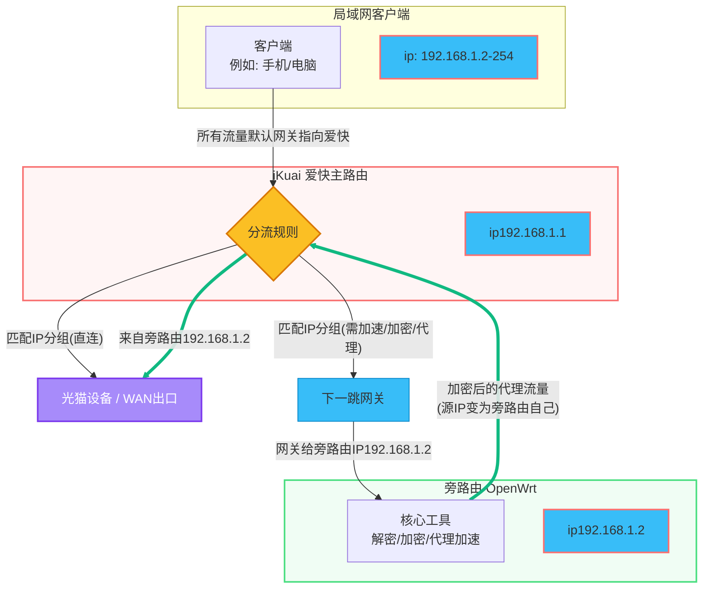
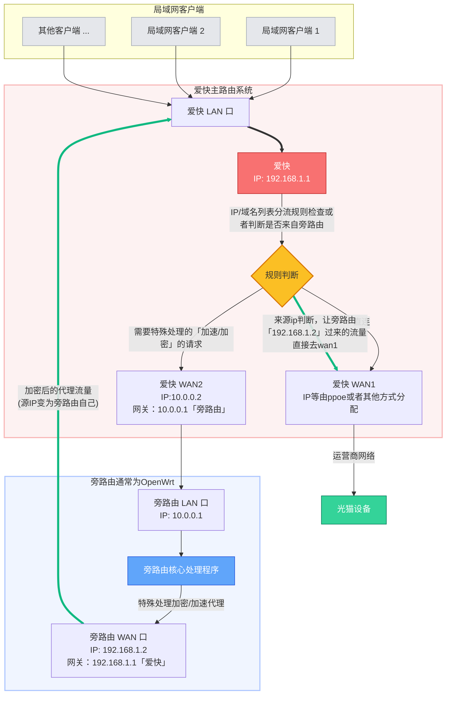

# 爱快两种分流模式解析

本项目支持两种主流的分流实现方案，您可以根据自己的网络拓扑选择最合适的模式。运行 CLI 时通过 `-m` 参数选择分流模式，详见 [CLI 参数说明](cli-params.md#分流模式--m)。


---
### 1. IP 分组与端口分流模式 

**适用场景：** 简单的旁路由方案，逻辑直接。

**实现逻辑：**

1. **IP 分组**：本工具将订阅的 IP 列表同步到 iKuai 的"IP 分组"中。
2. **策略路由**：利用 iKuai 的"端口分流"功能，匹配目标地址为该分组IP的流量，将其"下一跳网关"指向 旁路由（通常是OpenWRT） 的 IP。把流量导向旁路由

**数据流向：**

```
客户端 → iKuai 路由 → 检查请求的IP地址 → iKuai 物理 WAN1 接口 → 运营商光猫
                                   → 端口分流（下一跳指向 旁路由特殊处理) → 返回iKuai  → 运营商光猫

```

**特点**：配置简单直接，OpenWrt 宕机时匹配到该分组的规则将无法上网。



**参考文档**：[实现方式参考](https://github.com/joyanhui/ikuai-bypass/issues/7) 或 [恩山y2kji的教程](https://www.right.com.cn/forum/thread-8288009-1-1.html)。

### 2. 自定义运营商分流模式 

**适用场景：** 追求极致稳定性、网络自愈、终端无感分流。（需要多网卡或能添加虚拟网卡）
.
**实现逻辑：**
这种模式下，iKuai 将 OpenWrt（旁路由）视为一个"虚拟的上级运营商"。

1. **链路设计**：OpenWrt 作为 iKuai 的下级设备接收流量，处理后再将出口流量"绕回"给 iKuai 的 WAN 口。
2. **规则同步**：本工具将目标 IP 列表导入 iKuai 的"自定义运营商"。iKuai 会认为这些 IP 属于该"虚拟运营商"，从而将流量转发给 OpenWrt。

**数据流向：**

```
客户端 → iKuai 路由 → 检查IP/域名  

     → 直接走wan1/运营商光猫
     → 走wan2  → 旁路由 插件处理 → 重新交回 iKuai 的lan口 → ikuai根据来源 请求wan1/运营商光猫
```

**核心优势：**

- **极高可靠性**：旁路由 宕机只会导致被分流的流量中断，普通流量依然通过主线直连，不会全家断网。
- **配置无感**：终端设备无需更改网关配置，完全由 iKuai 在内核层级完成调度。
- **性能优异**：直连速度最快，旁路仅处理特定流量。

**参考文档**：[查看具体实现方式](https://dev.leiyanhui.com/route/ikuai-bypass-joyanhui/) 或 [恩山eezz的教程](https://www.right.com.cn/forum/thread-8252571-1-1.html)。



<details>
<summary>点击这里展开查看详细图文说明(自定义运营商分流模式拓扑图)</summary>

</details>

---

